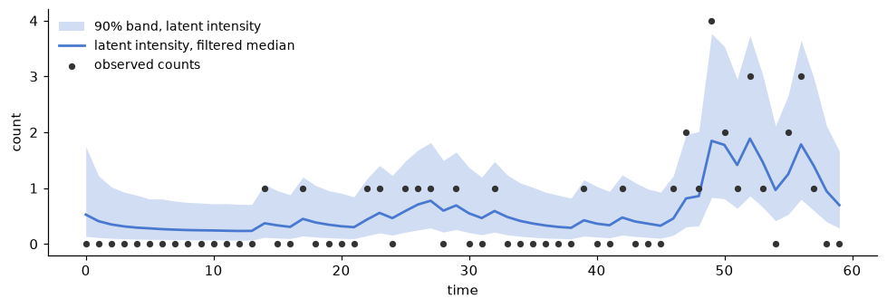

# A short introduction to sequential inference for state-space models

Which algorithm to use depends on the assumptions you are willing
to make about the form of your state-space model. It also depends on
which pieces of the model you are willing to assume known.
Let us start with a linear-Gaussian state-space model:

$$
\begin{aligned}
y_t &= F_t \theta_t + v_t, \qquad & v_t &\sim \mathcal{N}(0, V_t), \\
\theta_t &= G_t \theta_{t-1} + w_t, \qquad & w_t &\sim \mathcal{N}(0, W_t),
\end{aligned}
$$

where $F_t$ is the observation matrix, $G_t$ is the state-evolution
matrix, and $V_t$ and $W_t$ are the observation- and state-noise
covariance matrices. The noise sequences are independent over time, of each other, and of
the initial state $\theta_0 \sim \mathcal{N}(m_0, C_0)$. Everything in this display
is, for now, assumed known. The $t$ subscripts allow the matrices to
change through time. The closed forms below require only that the
matrices are known at each step, not that they are constant. We
return to what happens when they are not known at the end of this
tour. The classic first case there is an unknown observation
variance.

Three posterior distributions of the latent states are of common
interest. The filtering distribution $p(\theta_t \mid y_{1:t})$
conditions each state on the observations up to its own time. The
smoothing distribution $p(\theta_t \mid y_{1:T})$ conditions every
state on the complete record of $T$ observations. The forecast
distribution $p(\theta_{t+k} \mid y_{1:t})$ extends the
conditioning $k$ steps ahead. Filtering is the online problem: each
new observation updates the current state estimate as it arrives.
Smoothing is the retrospective problem: once the record is
complete, every earlier estimate is revised in light of the
observations that came after it. We focus on the filtering
distribution first. The smoothing recursions consume the filter's
output, and we return to that link below.

In this linear-Gaussian case with everything known, the filtering
distribution is also Gaussian
([West and Harrison, 1997](https://doi.org/10.1007/b98971);
[Durbin and Koopman, 2012](https://doi.org/10.1093/acprof:oso/9780199641178.001.0001)).
We write it as
$\theta_t \mid y_{1:t} \sim \mathcal{N}(m_t, C_t)$, where
$m_t = \mathrm{E}(\theta_t \mid y_{1:t})$. The classic Kalman
filtering equations
([Kalman, 1960](https://doi.org/10.1115/1.3662552)) update the pair
$(m_t, C_t)$ in closed form, one observation at a time. Suppose the
filtering distribution at time $t-1$ is
$\theta_{t-1} \mid y_{1:t-1} \sim \mathcal{N}(m_{t-1}, C_{t-1})$.
Evolving the state one step ahead gives the prior at time $t$,
$\theta_t \mid y_{1:t-1} \sim \mathcal{N}(a_t, R_t)$, with

$$
\begin{aligned}
a_t &= G_t m_{t-1}, \\
R_t &= G_t C_{t-1} G_t^\top + W_t.
\end{aligned}
$$

The implied one-step forecast of the next observation is
$y_t \mid y_{1:t-1} \sim \mathcal{N}(f_t, Q_t)$, with

$$
\begin{aligned}
f_t &= F_t a_t, \\
Q_t &= F_t R_t F_t^\top + V_t.
\end{aligned}
$$

Once $y_t$ is received, Bayes' theorem gives the new filtering
distribution $\theta_t \mid y_{1:t} \sim \mathcal{N}(m_t, C_t)$,
with

$$
\begin{aligned}
m_t &= a_t + A_t e_t, \\
C_t &= R_t - A_t Q_t A_t^\top,
\end{aligned}
$$

where $e_t = y_t - f_t$ is the forecast error and
$A_t = R_t F_t^\top Q_t^{-1}$ is the gain matrix. The form of the
recursions and the notation follow
[West and Harrison (1997)](https://doi.org/10.1007/b98971), ch. 4,
and
[Petris, Petrone, and Campagnoli (2009)](https://doi.org/10.1007/b135794).
These equations also make clear what needs to be known, defined, or
observed to carry them out. The model matrices
$F_t$, $G_t$, $V_t$, and $W_t$ must be known at every step. The prior
mean $m_0$ and covariance $C_0$ must be defined to start the
recursion. The only data needed at time $t$ is the newly observed
$y_t$. The pair $(m_{t-1}, C_{t-1})$ already carries everything the
earlier observations had to say. The new posterior becomes the prior
for the next observation and the cycle repeats. That is, the exact
posterior of the state $\theta_t$ is updated observation by
observation.

The filtered moments also support the retrospective pass. The
smoother of
[Rauch, Tung, and Striebel (1965)](https://doi.org/10.2514/3.3166)
starts from the final filtered posterior and runs backward through
the stored pairs $(m_t, C_t)$ and $(a_{t+1}, R_{t+1})$, revising
each state estimate with the information that arrived after time
$t$. The result is the smoothing distribution
$\theta_t \mid y_{1:T} \sim \mathcal{N}(m_t^s, C_t^s)$, with
the difference $C_t - C_t^s$ positive semidefinite in exact arithmetic
for a consistent linear-Gaussian record. The backward pass needs only
the stored forward moments and the transition matrices, so smcx exposes
the two passes separately:
`kalman_filter` returns the stored moments and `rts_smoother`
consumes them. Use the filter alone for online estimation and
forecasting. Add the smoother when the record is complete and the
question is what the states were.

Now we can relax the assumptions one at a time. Start with
linearity. In the linear-Gaussian model the products $G_t
\theta_{t-1}$ and $F_t \theta_t$ define linear functions. The
function $\theta \mapsto G_t \theta$ maps the state space to itself
and moves the state forward in time. The function
$\theta \mapsto F_t \theta$ maps the state space to the observation
space. Relaxing linearity replaces both with known nonlinear
functions $g_t$ and $h_t$:

$$
\begin{aligned}
y_t &= h_t(\theta_t) + v_t, \\
\theta_t &= g_t(\theta_{t-1}) + w_t.
\end{aligned}
$$

Every other assumption is kept. The noises are still additive and
Gaussian. The functions, the covariances, and the prior are still
known. Even so, the filtering distribution, in general, stops being
Gaussian, and the closed-form recursions are gone. Gaussian
approximations of the same evolve-forecast-update cycle survive. The
extended Kalman filter linearizes $g_t$ and $h_t$ at the current
mean and reuses the exact linear update. The unscented Kalman filter
instead propagates a small deterministic set of sigma points through
$g_t$ and $h_t$ and matches moments
([Julier and Uhlmann, 2004](https://doi.org/10.1109/JPROC.2003.823141)).
Both return an approximate pair $(m_t, C_t)$, not the exact
posterior
([Särkkä and Svensson, 2023](https://doi.org/10.1017/9781108917407)).
The matching extended and unscented smoothers carry this Gaussian
approximation through a backward pass over the stored moments.
`gaussian_smoother` evaluates transition Jacobians at the filtered means
under `taylor_order1`; it reevaluates the transition mean at sigma points
under `unscented`. Neither method reruns the observation side. The caller
must reuse the forward transition model and, if inputs were used, the
transition values `inputs[1:]`. It must also reuse the transition Jacobian
or sigma-point rule. An input-aware smoother still accepts a full length-`T`
array; `inputs[0]` is ignored. The record stores no model identity, so smcx
cannot compare that match at runtime. Both smoothing results remain
approximate. The extended and unscented recursions follow
[Cox (1964)](https://doi.org/10.1109/TAC.1964.1105635) and
[Särkkä (2008)](https://doi.org/10.1109/TAC.2008.919531), respectively. The
[custom models guide](custom-models.md)
gives runnable calls and the covariance requirements.

Now relax the distributional assumptions as well. The observations
may be discrete counts, bounded quantities, or heavy-tailed
measurements. The noise may enter multiplicatively rather than
additively. What remains is the structural assumption of the general
state-space model: the latent state process is a Markov chain and
the observations are conditionally independent given the states.
That is, $\theta_t$ depends only on the previous state
$\theta_{t-1}$, and $y_t$ depends only on the current state
$\theta_t$. The model is now specified by an observation density and
a state density,

$$
\begin{aligned}
y_t &\sim p(y_t \mid \theta_t), \\
\theta_t &\sim p(\theta_t \mid \theta_{t-1}), \qquad t \ge 1,
\end{aligned}
$$

with an initial density $\theta_0 \sim p(\theta_0)$. All three
densities are assumed known. Sequential Bayesian inference rests on
the same two steps as the Kalman filter, now written for a general
model. The first computes the one-step-ahead forecast density. The
second applies Bayes' theorem to turn the forecast into the next
filtering distribution
([Doucet, de Freitas, and Gordon, 2001](https://doi.org/10.1007/978-1-4757-3437-9)):

$$
\begin{aligned}
p(\theta_t \mid y_{1:t-1}) &= \int p(\theta_t \mid \theta_{t-1})\,
p(\theta_{t-1} \mid y_{1:t-1})\,d\theta_{t-1}, \\
p(\theta_t \mid y_{1:t}) &= \frac{p(y_t \mid \theta_t)\,
p(\theta_t \mid y_{1:t-1})}{\int p(y_t \mid \theta_t)\,
p(\theta_t \mid y_{1:t-1})\,d\theta_t}.
\end{aligned}
$$

Beyond the linear-Gaussian and finite-state cases, no closed form
computes those integrals. A particle filter maintains a Monte Carlo
approximation instead. The filtering distribution is represented by
$N$ particles and their normalized importance weights,
$\lbrace (\theta_t^{(i)}, w_t^{(i)}) : i = 1, \ldots, N \rbrace$,
so that

$$
p(\theta_t \mid y_{1:t}) \approx \sum_{i=1}^{N} w_t^{(i)}\,
\delta_{\theta_t^{(i)}},
$$

where $\delta_\theta$ denotes a unit point mass at $\theta$. From
here on $w$ denotes a weight. The evolution noise of the earlier
displays plays no further role, since the state density absorbs it.
The simplest version is the bootstrap filter of
[Gordon, Salmond, and Smith (1993)](https://doi.org/10.1049/ip-f-2.1993.0015).
Each particle is drawn one step forward from the state density and
the Bayes update is paid in weight through the observation density:

$$
\begin{aligned}
\theta_t^{(i)} &\sim p(\theta_t \mid \theta_{t-1}^{(i)}), \\
\tilde{w}_t^{(i)} &= w_{t-1}^{(i)}\, p(y_t \mid \theta_t^{(i)}).
\end{aligned}
$$

The unnormalized weights $\tilde{w}_t^{(i)}$ are then normalized to
sum to one. When too few particles carry too much of the weight, the
particles are resampled and the weights reset. These formulas again
make clear what is needed. We must be able to sample from the
initial density and the state density. We must be able to evaluate
the observation density at the received $y_t$. Beyond that the form
of the model is unrestricted. Refinements keep the same skeleton.
Auxiliary resampling looks one observation ahead to choose which
particles to propagate
([Pitt and Shephard, 1999](https://doi.org/10.1080/01621459.1999.10474153)).
Observation-informed proposals sharpen the approximation further
([Doucet, Godsill, and Andrieu, 2000](https://doi.org/10.1023/A:1008935410038)).

Finally, let the transition or observation densities depend on an
unknown static parameter. So far
every relaxation changed the form of the model. The pieces
themselves stayed known: first the matrices and covariances, then
the nonlinear functions, then the densities. Now drop that
assumption. Suppose the densities keep a known functional form but
depend on a vector of unknown parameters $\phi$. The unknowns could
be the evolution-matrix entries or the noise variances themselves.
To do Bayesian inference we must define one more piece, a prior for
$\phi$, and the model becomes:

$$
\begin{aligned}
\phi &\sim p(\phi), \\
y_t &\sim p(y_t \mid \theta_t, \phi), \\
\theta_t &\sim p(\theta_t \mid \theta_{t-1}, \phi).
\end{aligned}
$$

A static $\phi$ couples every time step to every other. In special
cases the exact posterior can still be updated by conjugate Bayesian
inference. For example, a linear-Gaussian model whose one unknown
variance scales every covariance in the model — the observation
noise, the evolution noise, and the initial-state covariance —
updates exactly, carrying only two summary statistics for the
variance alongside the Kalman pair $(m_t, C_t)$
([West and Harrison, 1997](https://doi.org/10.1007/b98971), ch. 4).
However, for the general state-space model no fixed set of summary
statistics carries $p(\theta_t, \phi \mid y_{1:t})$ forward
([Kantas et al., 2015](https://doi.org/10.1214/14-STS511)). The
augmented state $(\theta_t, \phi)$ does not rescue the particle
filter either. The recursion itself still holds, but a static $\phi$
is never refreshed by the state density. The particle cloud's $\phi$-support
can only ever shrink. Particle filters are sequential Monte Carlo
methods specialized to sequential state inference. Broader SMC
methods target other sequences of distributions through mutation,
weighting, and resampling. Tempered SMC is one example for static
parameters
([Chopin and Papaspiliopoulos, 2020](https://doi.org/10.1007/978-3-030-47845-2)).
We can rejuvenate $\phi$ online beside the states
([Liu and West, 2001](https://doi.org/10.1007/978-1-4757-3437-9_10)).
We can run a filter for every parameter particle
(SMC²: [Chopin, Jacob, and Papaspiliopoulos, 2013](https://doi.org/10.1111/j.1467-9868.2012.01046.x)).
Or we can temper a fixed-data posterior, moving from prior to
posterior through a ladder of temperatures
([Del Moral, Doucet, and Jasra, 2006](https://doi.org/10.1111/j.1467-9868.2006.00553.x)).

Each of these methods is implemented in smcx. The
[quickstart](quickstart.md) establishes the exact linear-Gaussian
baseline. The [custom models guide](custom-models.md) covers the
nonlinear, conjugate, and particle boundaries.

## Worked examples

The examples below instantiate the tour one rung at a time. The
variables in the code are named as the symbols in the displays, and
the blocks run in order as shown.

### A linear-Gaussian model, fully known
We start with a linear-Gaussian model with the observation matrix,
the state-evolution matrix, observation covariance matrix, state
covariance matrix, and initial-state distribution all assumed known.
This is the general form,

$$
\begin{aligned}
y_t &= F_t \theta_t + v_t, \qquad & v_t &\sim \mathcal{N}(0, V_t), \\
\theta_t &= G_t \theta_{t-1} + w_t, \qquad & w_t &\sim \mathcal{N}(0, W_t),
\end{aligned}
$$

with an initial state $\theta_0 \sim \mathcal{N}(m_0, C_0)$. In this
example let $F_t=1$, $G_t=0.8$, $V_t=V=0.3$, and $W_t=W=0.2$, with
$m_0 = 0$ and $C_0 = 1$, to give the model:

$$
\begin{aligned}
y_t &\sim \mathcal{N}(\theta_t,\ 0.3), \\
\theta_t &\sim \mathcal{N}(0.8\,\theta_{t-1},\ 0.2), \qquad
\theta_0 \sim \mathcal{N}(0, 1).
\end{aligned}
$$

In this case, the Kalman filter computes the exact
posterior and the exact marginal likelihood. The names in the code
are the symbols in the display:

```python
import jax
import jax.numpy as jnp
import jax.random as jr

import smcx

# fmt: off
y = jnp.array([
    -0.54, -1.09, -0.77, -0.03, 0.92, -0.45, 1.19, 0.24, 1.13,
    -0.42, 0.63, 1.18, 1.13, 0.64, 1.35, 2.25, 1.98, 1.65, 2.01,
    1.63, 0.80, 0.39, -0.68, -0.87, -0.96,
])[:, None]
# fmt: on

m0 = jnp.zeros(1)
C0 = jnp.eye(1)
G = 0.8 * jnp.eye(1)
W = 0.2 * jnp.eye(1)
F = jnp.eye(1)
V = 0.3 * jnp.eye(1)

posterior = smcx.kalman_filter(m0, C0, G, W, F, V, y)
print(posterior.marginal_loglik)  # -29.26, exact
```

### The observation variance unknown

Now we relax the assumptions, both about the form of the
state-space model and about which parameters are known. Let us
suppose the observation variance $V$ is unknown. The matrices $F_t$
and $G_t$ stay known. Exactness of the Kalman filtering equations
survives only under a specific structure: the state covariance must
be $W = V\tilde{W}$ with $\tilde{W}$ known, so the single unknown
$V$ scales both noises and the initial-state covariance,
$C_0 = V\tilde{C}_0$. Give $V$ an Inverse-Gamma prior. This is the
general form,

$$
\begin{aligned}
y_t &\sim \mathcal{N}(F_t\,\theta_t,\ V), \\
\theta_t &\sim \mathcal{N}(G_t\,\theta_{t-1},\ V \tilde{W}), \qquad
V \sim \mathrm{IG}(\alpha, \beta).
\end{aligned}
$$

In this example we keep the model of the first example and forget
$V$. Let $F_t = 1$, $G_t = 0.8$,
$\tilde{W} = W/V = 0.2/0.3$, and
$\tilde{C}_0 = C_0/V = 1/0.3$, with the prior
$V \sim \mathrm{IG}(2, 1)$, to give the model:

$$
\begin{aligned}
y_t &\sim \mathcal{N}(\theta_t,\ V), \\
\theta_t &\sim \mathcal{N}(0.8\,\theta_{t-1},\ \tfrac{2}{3}\,V), \qquad
V \sim \mathrm{IG}(2, 1).
\end{aligned}
$$

This is the one structure where a static parameter still updates
exactly (West and Harrison, 1997). `dlm_filter` carries the joint
posterior in closed form. Its `prior_shape` and `prior_scale` are
$n_0 = 4$ and $S_0 = 0.5$ in
$V \sim \mathrm{IG}(n_0/2,\ n_0 S_0/2)$. The data were generated
with $V = 0.3$:

```python
C0_tilde = (1 / 0.3) * jnp.eye(1)  # C0 / V, keeping C0 = 1
F_vector = jnp.ones(1)
W_tilde = (0.2 / 0.3) * jnp.eye(1)
n0 = 4.0
S0 = 0.5

posterior = smcx.dlm_filter(
    m0,
    C0_tilde,
    G,
    F_vector,
    y,
    scale_free_transition_covariance=W_tilde,
    prior_shape=n0,
    prior_scale=S0,
)
print(posterior.scale_estimates[-1])  # 0.32, the truth was 0.3
```

### Count observations, nothing Gaussian

Now we relax the distributional assumptions themselves. The
observations are counts, so no Gaussian form fits. What remains
known is the form of the two densities and their parameters. This
is the general form,

$$
\begin{aligned}
y_t &\sim p(y_t \mid \theta_t), \\
\theta_t &\sim p(\theta_t \mid \theta_{t-1}),
\end{aligned}
$$

with an initial density $\theta_0 \sim p(\theta_0)$. In this example
let the observation density be Poisson with rate $e^{\theta_t}$ and
the state density Gaussian with $\rho = 0.9$ and $\sigma = 0.4$, to
give the model:

$$
\begin{aligned}
y_t &\sim \mathrm{Poisson}(e^{\theta_t}), \\
\theta_t &\sim \mathcal{N}(\rho\,\theta_{t-1},\ \sigma^2), \qquad
\theta_0 \sim \mathcal{N}(0, 1).
\end{aligned}
$$

No Kalman variant can run this. A particle filter can. The model is
the densities of the display as three ordinary functions: a sampler
for the initial density, a sampler for the state density, and the
log observation density. Its parameters are a PyTree that smcx
threads through every call, so `jax.grad` differentiates the
estimator in one call:

```python
def sample_initial(key, params, input_0):
    return jr.normal(key, (1,))


def sample_transition(key, state, params, input_t):
    noise = params["sigma"] * jr.normal(key, state.shape)
    return params["rho"] * state + noise


def log_observation(count, state, params, input_t):
    # Poisson log density up to a count-only constant.
    return count[0] * state[0] - jnp.exp(state[0])


model = smcx.StateSpaceModel(
    sample_initial=sample_initial,
    sample_transition=sample_transition,
    log_observation=log_observation,
)
params = {"rho": jnp.asarray(0.9), "sigma": jnp.asarray(0.4)}
counts = jnp.asarray([[1], [0], [2], [1], [3]], dtype=jnp.int32)


def log_marginal(params):
    fk = smcx.bootstrap_fk(model, params, counts)
    return smcx.run_smc(jr.key(0), fk, num_particles=4_096).marginal_loglik


gradient = jax.grad(log_marginal)(params)
```

Be precise about what this gradient is. It is the fixed-key
pathwise derivative of the realized program — the exact derivative
of this run's log marginal likelihood estimate, not of the true log
marginal likelihood. Three gaps separate the two. First, the
resampling step selects integer ancestors, and those selections are
constants to `jax.grad`, so with resampling active — as it is here
at the default threshold — the derivative ignores how resampling
probabilities change with the parameters; on a linear-Gaussian test
model where the exact score is available from `kalman_filter`, the
resampling-on average over keys sits many standard errors from the
truth. Second, even with resampling disabled, the average over keys
satisfies $E[\nabla \log \hat Z_N] = \nabla E[\log \hat Z_N]$
under the usual interchange conditions, and
$\nabla E[\log \hat Z_N]$ in general need not equal
$\nabla \log E[\hat Z_N] = \nabla \log Z$, the score — the log
of an unbiased estimate is biased, and the same gap defines
filtering variational objectives
([Maddison et al., 2017](https://arxiv.org/abs/1705.09279)). Under
appropriate regularity the gap tends to zero as particles grow, so
for differentiable models without resampling the estimator is a
consistent, finite-$N$-biased score approximation
([Ścibior and Wood, 2021](https://arxiv.org/abs/2106.10314)).
Third, the pathwise derivative sees only reparameterized
randomness: a parameter that acts through a discrete draw (a
regime indicator, a jump count) contributes nothing, and the
derivative can be exactly zero at any particle count. The gradient
remains useful as an optimization signal, and the transform itself
is fully supported; the corrected estimators
(stop-gradient resampling, Ścibior and Wood, 2021; differentiable
resampling, [Corenflos et al., 2021](https://proceedings.mlr.press/v139/corenflos21a.html))
are out of smcx's current scope.

On a longer series from this model, the filtered intensity tracks
the counts and the band widens where the data are sparse. The band
is for the latent intensity $e^{\theta_t}$, not for the counts.



### The evolution coefficient unknown

Finally we relax the assumption that the model is fully known.
Suppose the model depends on a vector of unknown parameters $\phi$
with a prior. This is the general form,

$$
\begin{aligned}
\phi &\sim p(\phi), \\
y_t &\sim p(y_t \mid \theta_t, \phi), \\
\theta_t &\sim p(\theta_t \mid \theta_{t-1}, \phi).
\end{aligned}
$$

In this example we return to the first model and make its evolution
coefficient unknown. Let $\phi$ replace $0.8$ with a uniform prior.
Everything else stays known. This gives the model:

$$
\begin{aligned}
\phi &\sim \mathrm{Uniform}(-1, 1), \\
y_t &\sim \mathcal{N}(\theta_t,\ 0.3), \qquad
\theta_t \sim \mathcal{N}(\phi\,\theta_{t-1},\ 0.2), \qquad
\theta_0 \sim \mathcal{N}(0, 1).
\end{aligned}
$$

Online particle schemes for this posterior degenerate, as the tour
explains (Kantas et al., 2015). Adaptive tempered SMC anneals from
the prior to the posterior instead. The likelihood it targets is the exact
Kalman marginal from the first example, evaluated per particle — an
exact filter composed inside an SMC sampler:

```python
def log_likelihood(phi):
    return smcx.kalman_filter(
        m0, C0, phi.reshape(1, 1), W, F, V, y
    ).marginal_loglik


def sample_prior(key, num_particles):
    return jr.uniform(key, (num_particles, 1), minval=-1.0, maxval=1.0)


def log_prior(phi):
    return jnp.where(jnp.abs(phi[0]) < 1.0, 0.0, -jnp.inf)


posterior = smcx.temper(
    jr.key(1),
    sample_prior,
    log_prior,
    log_likelihood,
    num_particles=1024,
)
weights = smcx.normalize(posterior.log_weights)
print(weights @ posterior.particles[:, 0])  # 0.87, the truth was 0.8
```
